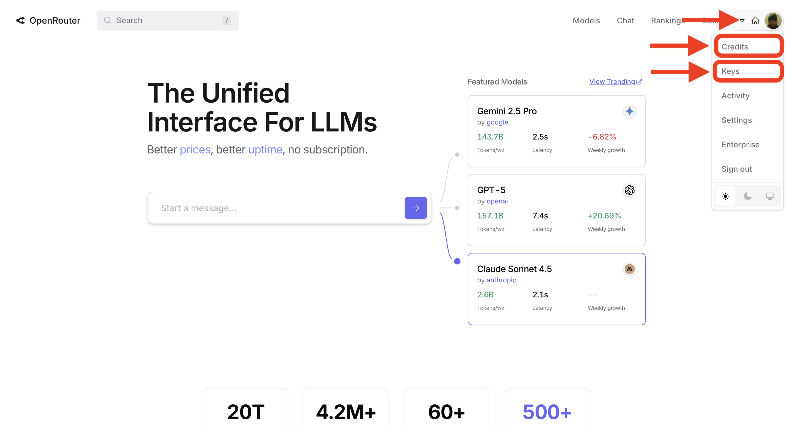
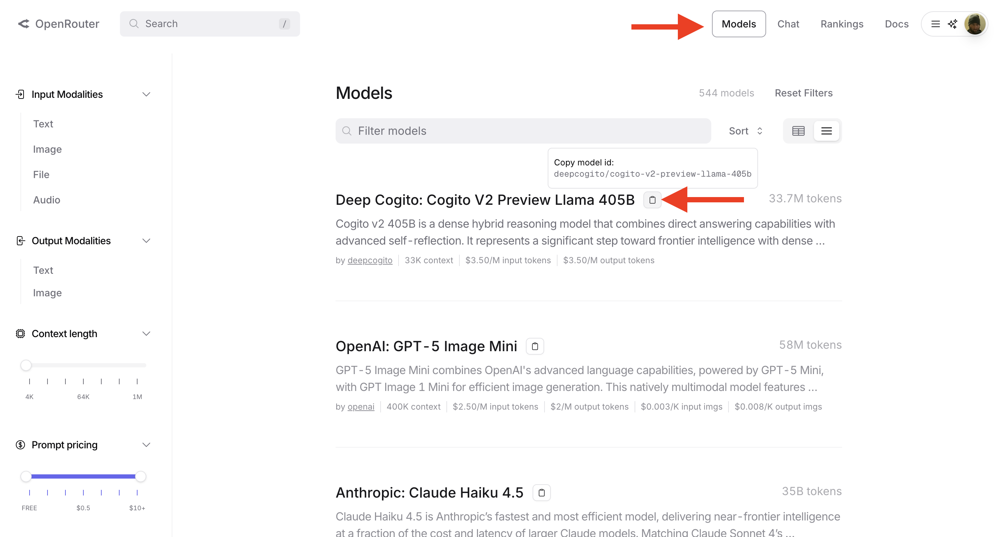

# Fusion Studio

A lightweight chat interface for OpenRouter AI models. Manage up to 10 concurrent chat threads, load custom prompts, and integrate JSON data seamlessly.

---

## Getting Started

### How to Get an API Key from OpenRouter

1. Visit [OpenRouter.ai](https://openrouter.ai/)
2. Sign up or log in to your account
3. Navigate to your **Dashboard** or **API Keys** section
4. Click **Create API Key**
5. Give your key a name (e.g., "Fusion Studio")
6. Copy your new API key (it will look something like `sk-or-v1-...`)
7. Keep this key safe! You'll need it to use Fusion Studio

**Note:** OpenRouter requires credits to use. Make sure your account has a balance before making API calls.

---

### Setting Your API Key

1. Open Fusion Studio in your browser
2. Click the **Add API Key** button (located beneath the chat area between "Send" and "Add JSON" buttons)
3. Paste your OpenRouter API key into the prompt
4. Click **OK** or press Enter

Your API key is saved locally in your browser and will persist between sessions. The button will change to **Clear API Key** once a key is set.

**IMPORTANT: If your laptop is ever lost or stolen, IMMEDIATELY go to openrouter.ai and revoke your API key. You should also consider setting a spend limit as an extra layer of protection.**

---

### Starting a Thread

Fusion Studio gives you **10 chat slots** so you can run multiple conversations at once.

**To start a new thread:**

1. Look at the **left panel** with numbered slots (1–10)
2. Click any slot that says **"Empty..."**
3. A prompt will appear asking you to **name your chat**
4. Type a name and click **OK**
5. The slot will now show your chat name

**To switch between threads:**
- Click any chat slot to switch to that conversation
- The active chat name appears at the top of the screen

**To manage a thread:**
- **Right-click** on any chat slot to open the context menu
- Choose from:
  - **Rename** – Change the chat name
  - **Export Chat** – Download the conversation as JSON
  - **Clear Chat** – Delete all messages (keeps prompt, model, and JSON)

---

### Setting and Saving a Prompt

The **right panel** is your prompt area. This is where you load a system prompt that tells the AI how to behave.

**To load a prompt:**

1. Click the **View Prompt** tab at the top right to see the prompt editor
2. Click the **Add Prompt** button in the bottom-right corner
3. Select a `.md` (Markdown) file from your computer
4. The file contents will appear in the prompt text area

**To edit the prompt:**
- Click inside the prompt text area and type directly
- Changes save automatically after a brief pause
- This prompt applies to the **currently active chat**

**PLEASE NOTE: Prompt applies only to the current chat. You will need to re-upload or copy paste your prompt when starting another chat.**

**Why use prompts?**
Prompts give the AI personality, instructions, or context. For example:
- "You are a helpful coding assistant."
- "Answer all questions in pirate speak."
- "You are an expert in JavaScript debugging."

---

### Adding a JSON File

Fusion Studio lets you attach JSON files to your messages. This is useful for feeding data into the AI or working with structured information.

**To add a JSON file:**

1. Click the **Add JSON** button (located in the input footer)
2. Select a `.json` file from your computer
3. The filename will appear where it said "No file loaded"
4. The button will change to **Remove JSON**
5. Type your message in the text area
6. Click **Send**

**What happens:**
- The JSON file contents are included with your message
- The AI can read and work with the data
- The file stays loaded until you remove it or switch chats

**To remove a JSON file:**
- Click the **Remove JSON** button and confirm removal

---

### Managing Your Messages

You can edit, regenerate, or delete any of your previous messages using the right-click context menu.

**To access message options:**

1. **Right-click** on any of your messages (user bubbles in the chat)
2. Choose from:
   - **Regenerate** – Deletes this message and everything after it, then resends the message
   - **Delete** – Deletes this message and everything after it permanently
   - **Edit** – Deletes this message and everything after, and places the text in the input field for editing

**Warning:** All three options will delete the selected message and ALL messages that came after it. This cannot be undone!

**Why use this?**
- Fix typos in past messages
- Try different phrasings to get better responses
- Remove unwanted conversation branches
- Start fresh from any point in the conversation

---

### Exporting Thread Data

You can export any chat thread as a JSON file to save your conversation history.

**To export a thread:**

1. **Right-click** on the chat slot you want to export
2. Select **Export Chat** from the context menu
3. A JSON file will download to your computer

**What's in the export?**
The JSON file contains:
- Chat name
- Selected model
- Full conversation history (all messages and responses)
- Timestamp of export

**Why export?**
- Backup important conversations
- Share conversations with others
- Analyze chat data programmatically
- Import into other tools

---

## Additional Features

### Model Selection
Choose from multiple AI models using the dropdown at the top (next to the chat name):
- DeepSeek models (with extended reasoning)
- Qwen models  
- Inclusion AI models (Ling and Ring)
- Moonshot AI models
- **+ Add Model** to add custom models by pasting model IDs from OpenRouter

**To add a custom model:**

1. Visit [OpenRouter.ai/models](https://openrouter.ai/models)
2. Browse or search for the model you want to use

3. Copy the model's ID (it looks like `provider/model-name`)
4. In Fusion Studio, click the **Model Selector** dropdown
5. Select **+ Add Model** at the bottom
6. Paste the model ID into the prompt
7. Click **OK** – your model is now saved and ready to use!

**Reasoning Display:**
Models that support reasoning (like DeepSeek) will show their thinking process in a separate section above the main response.

**Markdown Formatting:**
All AI responses support markdown formatting including **bold**, *italic*, `code blocks`, lists, and more. The formatting is rendered automatically in both responses and reasoning traces.

### View Tabs
At the top right, you'll find three tabs:
- **View README** – See this documentation (you're reading it!)
- **View Prompt** – Edit and preview the active prompt
- **View Payload** – See the raw JSON data sent to the API

### Clear All Data
The **Clear All Data** button at the bottom of the left panel deletes all 10 chat threads at once, including all messages, prompts, and settings. Use with caution!

---

## Tips & Tricks

- **Organize your chats:** Use descriptive names like "Debug Session" or "Brainstorm Ideas"
- **Save your prompts:** Keep useful prompts in `.md` files for quick loading
- **Check your payload:** If messages aren't working, click "View Payload" to see what's being sent
- **Export frequently:** Back up important conversations before they get too long

---

## Troubleshooting

**API calls aren't working:**
- Make sure your API key is set correctly
- Check that your OpenRouter account has credits
- Verify you have internet connection

**Chat slots aren't saving:**
- Make sure you're not in incognito/private browsing mode
- Check if your browser allows local storage

**JSON file won't load:**
- Ensure the file is valid JSON (use a validator like jsonlint.com)
- Make sure the file extension is `.json`

---

## About Fusion Studio

Fusion Studio is a browser-based chat client built for power users who need:
- Multiple parallel conversations
- Custom system prompts
- JSON data integration
- Full conversation exports

Built with vanilla HTML, CSS, and JavaScript. No frameworks, no bloat.

---

Enjoy chatting! 🚀

